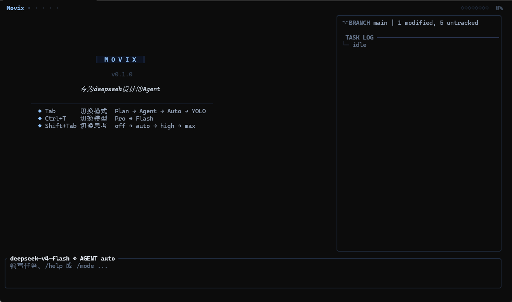

# Movix

[](https://github.com/Tinxyoo/Movix/actions/workflows/ci.yml)
[](LICENSE)
[](https://deepseek.com/)

> **A blazing-fast Rust TUI coding agent, natively tuned for DeepSeek V4.**
>
> 一个专为 **DeepSeek V4** 从零调优的 Rust 终端 AI 编程 Agent。

[English](#quick-start) · **中文**

---

Movix 在终端里给你类 IDE 的 AI 编程体验,同时保留 shell 的速度与可控性。它也能跑其它
OpenAI 兼容 API,但部分 V4 专属特性会自动降级。

<p align="center">
  
  <br>
  <em>启动界面:快捷键速查 + 状态栏 + 三栏布局</em>
</p>

- 🎯 **专为 DeepSeek V4 打造** — 原生 `reasoning_effort`(4 档:off/auto/high/max)/ `thinking_mode`(token 级解析)/ Pro ↔ Flash 手动切换
- 🧠 **四种运行模式** — Plan → Agent → Auto → YOLO,按需选择自由度
- 💬 **实时流式输出** — token 级渲染,思考过程可展开/收起
- 🔧 **14 个内置工具 + MCP** — 文件 / Shell / 搜索 / Git / Web + 外部 MCP 服务器
- 🛡️ **多层安全防护** — 启发式风险扫描 + 模式级审批(非 OS 级隔离)

---

## Quick Start / 快速开始

### 1. 安装

**全平台一行命令**(需 Rust 1.87+,let-chains 稳定要求):

```bash
cargo install --git https://github.com/Tinxyoo/Movix --locked
```

**没有 Rust?** 用安装脚本自动安装 Rust + 编译 Movix:

```bash
# Linux / macOS / WSL
curl -fsSL https://raw.githubusercontent.com/Tinxyoo/Movix/main/install.sh | bash

# Windows PowerShell
iwr -useb https://raw.githubusercontent.com/Tinxyoo/Movix/main/install.ps1 | iex
```

### 2. 配置 API Key

任选其一:

**A. 交互式(推荐新手)** — 直接 `movix` 启动,程序会引导输入并存到 `~/.movix/.env`。

**B. 环境变量(适合 CI / 容器):**

```bash
export DEEPSEEK_API_KEY="sk-your-key-here"   # Linux / macOS
$env:DEEPSEEK_API_KEY = "sk-your-key-here"   # Windows PowerShell
```

### 3. 启动

```bash
cd ~/my-project
movix                  # 交互式 TUI(推荐)
```

---

## Usage / 使用

```bash
movix                                 # 交互式 TUI(推荐)
movix -t "修复 src/main.rs 的编译错误" # 单任务:跑完即退出,适合脚本
movix -t "重构 auth.rs" -w ~/projects # 指定工作区
movix -m deepseek-v4-pro              # 临时切换模型
movix --no-thinking                   # 禁用推理(更快)
movix --reasoning-effort max          # 推理强度:off / auto / high / max
movix tools                           # 列出可用工具
movix info                            # 查看当前配置
movix --version                       # 期望:movix 0.1.0
```

### CLI 参数

```text
movix [OPTIONS] [COMMAND]

Commands:
  tools    列出可用工具
  info     显示当前配置

Options:
  -m, --model <MODEL>             模型名(deepseek-v4-pro / deepseek-v4-flash)
  -w, --workspace <PATH>          工作区目录
  -t, --task <TASK>               非交互模式:执行单任务
      --no-thinking               启动时禁用推理
      --reasoning-effort <EFFORT> 推理强度:off / auto / high / max
  -h, --help                      帮助
  -V, --version                   版本
```

### 快捷键

| 键 | 功能 |
|----|------|
| `Tab` | 切换模式(Plan → Agent → Auto → YOLO) |
| `Ctrl+T` | 切换模型(Pro ↔ Flash) |
| `Shift+Tab` | 切换思考强度(off → auto → high → max) |
| `Ctrl+O` | 展开/收起思考过程 |
| `↑` `↓` | 空输入时滚动对话 |
| `PgUp` `PgDn` | 翻页 |
| `g` | 跳到底部 |
| `?` | 帮助面板 |
| `Ctrl+C` | 退出 |

---

## Built-in Tools / 内置工具

12 个核心工具(由 `create_default_registry` 注册)+ 2 个技能工具(`list_skills` / `use_skill`)+ MCP 动态扩展。

| 工具 | 说明 |
|------|------|
| `read_file` / `write_file` / `patch_file` | 读 / 写 / 精确替换文件 |
| `list_dir` | 列目录 |
| `run_command` | 执行 Shell(受沙箱保护) |
| `search_code` / `grep` | 语义搜索 / 正则搜索 |
| `git_status` / `git_diff` / `git_log` | Git 状态 / 差异 / 日志 |
| `web_search` / `web_fetch` | 网络搜索 / 抓取网页 |
| `list_skills` / `use_skill` | 列出 / 调用技能 |

MCP 工具通过 `.env` 的 `MOVIX_MCP_SERVERS` 或工作区 `.movix/mcp.json` 接入,运行时自动注册。

---

## Why DeepSeek V4? / 为什么为 V4 设计

> Movix 围绕 V4 架构从零设计。用其它模型也能跑,但以下能力仅在 V4 完整生效。

| V4 特性 | Movix 实现 |
|---------|-----------|
| `reasoning_effort` 4 档 | `Shift+Tab` 一键切换,UI 实时显示 |
| 混合 `thinking_mode` | 原生 `reasoning_content` 字段流式渲染;`Scavenger`/`ArgRepair` 修复工具调用 JSON |
| Pro / Flash 双模型 | `Ctrl+T` 手动切换;`Selector` 自动切换为预留,未接线 |
| 分层上下文 | 分层窗口(默认 900K)+ API 缓存命中统计 + 启发式截断,跑大仓库不爆 |
| 384K 单次输出 | `MOVIX_MAX_TOKENS=393216`,请求自动 `min(config, 384K)` 防 400 |
| 流式 + 工具串行 | 工具逐个串行执行(读/写均串行;并行只读调度为预留,未接线) |

**非 V4 模型的降级行为:** 缺 `reasoning_effort` → 退化为单档;缺 `thinking_mode` 解析 → 推理内容不显示;单模型 API → 关闭 `Selector`;价格未配置 → 估算显示"未知"。

---

## Advanced Features / 高级特性

- **🔍 Reviewer** — `/review` 基于真实 diff(已修复:此前空审)做正确性/安全/性能/风格四维评审,严重度分级(Blocker / Major / Minor / Info)。**注:当前评审器复用主 Agent 模型,并非独立模型。**
- **💰 Pricing** — 侧栏实时 token + ¥ 估算。**定价由运行时 `~/.movix/pricing.toml` 加载,未配置时走 `pricing.rs` 内置默认。** `/pricing` 可从官方拉取最新价目。
- **✅ VerifyLoop** — 轮次末自动跑 `cargo check` / `py_compile` / `tsc` 等编译级检查(仅在有对应构建文件时,如 Cargo.toml),错误回灌给模型自我修正(同一批错误最多回灌 3 轮,防上下文爆炸)。
- **💾 Snapshot** — 写文件前建内容寻址快照(只记差异),失败时可回滚。存储在 `~/.movix/snapshots/`。**自动回滚只作用于 agent 实际修改过的文件;找不到具体文件时拒绝回滚,不会全量 `git checkout` 丢弃你的并发改动。**
- **📋 工具调度** — 工具逐个串行执行(读/写均串行;并行只读调度为预留模块,未接线)。
- **🧠 Selector** — 推理强度(effort)按任务复杂度自动调节已接线;**Pro/Flash 自动切换为预留,未接线**,请用 `Ctrl+T` 手动切换。
- **🛡️ 多层安全** — 路径越界 / 敏感文件读写(含 `.env`、SSH 密钥,读取同样受限)/ 危险命令(含长选项/反斜杠/`~` 家目录等绕过变体)/ 出网控制(shell 默认禁 `curl`/`git push` 等外发)/ SSRF / 模式级审批。**工作区 `.movix/mcp.json` 的服务器需设 `MOVIX_TRUST_MCP_FILE=1` 才会自动连接**(防止恶意仓库自证 `trusted:true` 即 RCE)。
- **🔄 自愈与熔断** — `LoopGuard`(重复 3 次中断)、`FailureTracker`(连续失败建议换模型)、`ArgRepair`(非法 JSON 修复)、`Scavenger`(从 markdown 代码块提取工具调用)。

> ⚠️ **Sandbox 是启发式风险扫描,不是 OS 级隔离。** 不可信任务下跑 Auto/YOLO,请配合 Docker / 虚拟机 / `bubblewrap`。工作区 `.movix/skills`、`.movix/mcp.json` 等来源不可信:技能内容仅以 `<untrusted>` 标签包裹作为**软提示**注入 LLM(无执行隔离),真正的防线是 `use_skill` 的强制审批 —— 在 Auto/YOLO 模式下打开陌生仓库的 skill 仍可能被 prompt 注入利用。MCP 服务器同理,需 `MOVIX_TRUST_MCP_FILE=1` 才连接。

### 项目指令(AGENT.md)

启动时 Movix 会自动加载工作区里的 `AGENT.md`(查找顺序:`.movix/AGENT.md` → `AGENT.md` → `.github/AGENT.md`),
用于注入项目级约定(代码风格、命名、禁止操作等)。**仓库不附带示例文件,需自行创建。**


---

## License

[MIT](LICENSE) © 2026 Movix Contributors


## Contact / 联系

- 📧 [dremo@qq.com](mailto:dremo@qq.com)


---

<p align="center">
  <sub>Built with Rust 🦀 by Movix Contributors</sub>
</p>
